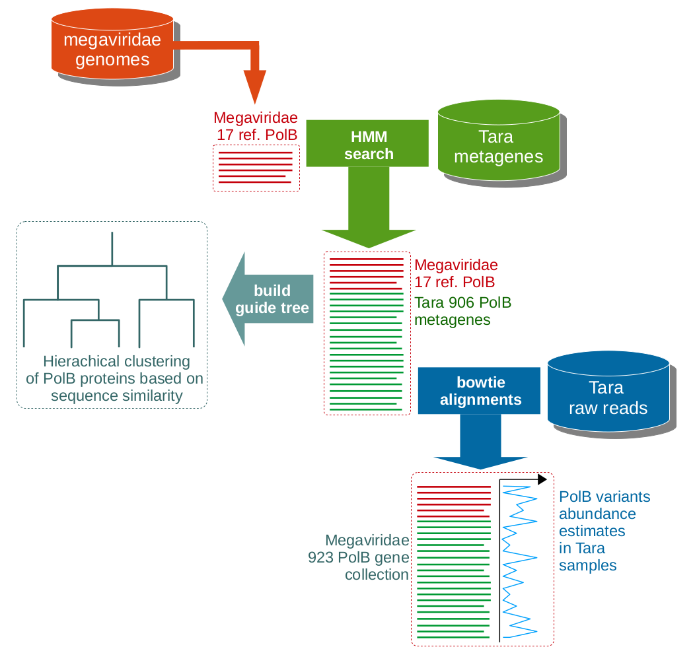
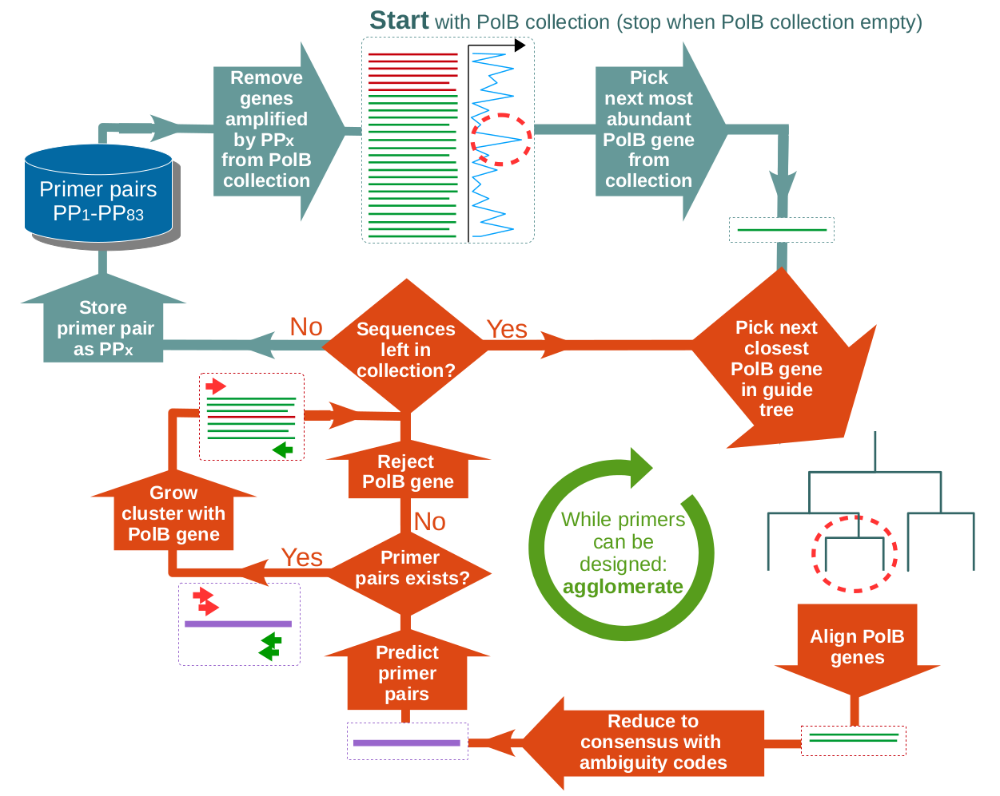
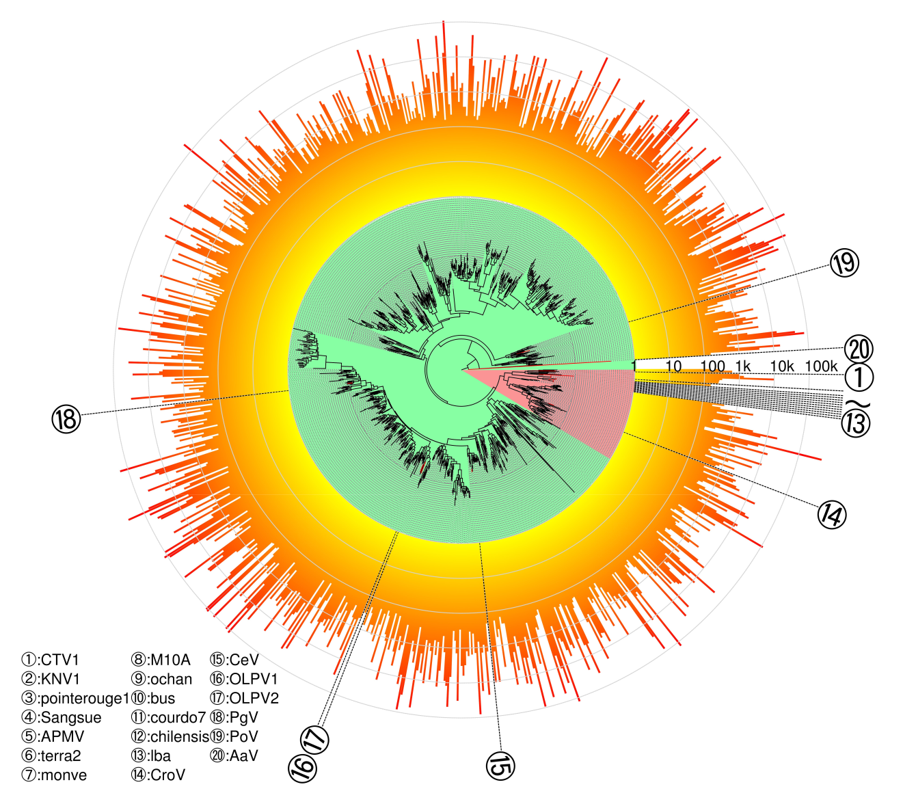

# UjiLity - UJI muLtiple prImer uTilitY

A script to design sets of oligonucleotide primers with controlled degeneracy aimed at amplifying marker genes with very high sequence diversity (e.g. virus diversity studies).
    
The script was written in the spring of 2015 in Uji, Japan, by Pascal Hingamp as a Kyoto University visiting scholar in the lab of Hiro Ogata whose team members provided instrumental insights during development: Hiro Ogata, Takashi Yoshida, Susumu Goto, Tomoko Mihara & Yosuke Nishimura. The resulting primer design strategy was validated  by an experimental test of a UjiLity designed set of primers (called MEGAPRIMER) that demonstrated detection of giant viruses diversity in marine water: https://www.ncbi.nlm.nih.gov/pmc/articles/PMC6163766/ 

The UjiLity script applies high-throughput agglomerative iterations of the ```primer3``` oligonucleotide design software (Fig 2). Briefly, the MSA is scanned with a sliding window, for each window, a growing MSA subset starting from a single sequence then adding progressively the next closests homologs (hence the agglomerative appelation) is subjected to primer3 (via boiling down to a consensus sequence of the MSA subset) until adequate primers can no longer be designed, given the user defined constraints of Tm, degeneracy, & amplicon size. The primer pair for the last successful MSA subset is added to the collection of primer pairs, then a the process is reapeated starting with a new yet un-amplified sequence, until all sequences of the MSA have been exhausted. The order of sequence picking from the whole MSA defined by next smallest distance in a guide tree, as well as optional weights for each sequence of the MSA (in our case we used ecological abundance in metagenomes). Preparation of the input MSA and guide tree is schematised in figure 1.

<table>
  <tr>
    <td></td><td></td></tr>
    <tr><td>Figure 1: Schematic diagram of the building of the Megaviridae polB collection. This figure shows how the input data (reference Megaviridae genomes, Tara Oceans metagenes, and Tara Oceans raw reads) were used to produce a Megaviridae guide tree and a collection of 923 Megaviridae polB gene sequences.</td><td>Figure 2: Schematic diagram of the design of the set of Megaviridae polB primer pairs. This figure shows the greedy agglomerative iterative procedure guided by the estimated environmental polB abundances (derived from read mappings) and the polB sequence similarities (encoded in the guide tree).</td></tr></table>

## Running the script
 - clone the git repo
 - install the required accessory apps via your favorite package manager (```seqkit```, ```primer3```, ```t_coffee```, ```blast```, ```mafft```)
 - ```UjiLity``` overides completely the Tm constaints included in the otherwise very efficient ```primer3``` software, due to its incpacity to deal with sequences with degenerate (ambiguous) positions (which are extremely frequent when aligning diverse distant homologs). Instead ```UjiLity``` actually recursively expands the primers with degenerate positions and uses the very apt ```dnaMATE``` binary to accuratly estimate the Tm of all implicit oligonucleotides, an then provides the estimated Tm dispertion of each degenerate oligo
 - some required bits & pieces are provided as binaries in bin/ (difficult to get hold of, such as ```dnaMATE``` which had to be hacked to run on 64 bits Linux, and ```nw_luaed``` which is often the only app in the so usefull ```nw_utils``` suite that can prove tricky to compile), whilst others such as ```pal2nal``` are directly integrated in the script (being Perl and all).
 - on an HPC cluster to scan a sub region of the included multiple alignment, submit ```Ujility_scan_sbatch.sh``` to slurm, eg with the example input dataset from a giant virus DNA polymerase multiple alignment:
```
  sbatch --partition=fast --job-name=UjiLity_v2 --array=1-50 --time=0-10:00 Ujility_scan_sbatch.sh Uji_v2 14032 6 256 45 51
  #USAGE Ujility_sbatch.sh job_name offset step degen mintm maxtm
```
 - if you don't have access to an HPC cluster, you can use the simple ```UjiLity_scan.pl``` with a poor man's parallelisation implementation to scan your MSA
 - after completion of all the jobs, you can run the reporting script ```./UjiLity_scan_report.pl 'Uji_v2' Uji_results 881``` to get an overview of the number of primer pairs necessary to amplify the targets, with their degeneracy and melting temperatures ranges (both are controlled in the sbatch script parameters):
```
JOB	START	END	INCL	PERC	DETECTED	NB_PRIMER_PAIRS	MIN_TM	MAX_TM	MAX_DEGEN	P3_CONF	MAX_P3	MAX_NEG	SUM_DEGEN
2.1	14032	14522					45	51	256	primer3_run_params.p3	500	20	
2.2	14038	14528	852	96.71		194	45	51	256	primer3_run_params.p3	500	20	
2.3	14044	14534	861	97.73	874	195	45	51	256	primer3_run_params.p3	500	20	36859
2.4	14050	14540	870	98.75	884	192	45	51	256	primer3_run_params.p3	500	20	37351
2.5	14056	14546	869	98.64	883	193	45	51	256	primer3_run_params.p3	500	20	37256
2.6	14062	14552	860	97.62	877	201	45	51	256	primer3_run_params.p3	500	20	37194
2.7	14068	14558	849	96.37	864	210	45	51	256	primer3_run_params.p3	500	20	33045
2.8	14074	14564	812	92.17	826	210	45	51	256	primer3_run_params.p3	500	20	33002
2.9	14080	14570	723	82.07	737	194	45	51	256	primer3_run_params.p3	500	20	30931
2.10	14086	14576	216	24.52	221	55	45	51	256	primer3_run_params.p3	500	20	6622
2.11	14092	14582	53	6.02	55	12	45	51	256	primer3_run_params.p3	500	20	1455
2.12	14098	14588	9	1.02	10	3	45	51	256	primer3_run_params.p3	500	20	12
2.13	14104	14594	9	1.02	10	3	45	51	256	primer3_run_params.p3	500	20	15
2.14	14110	14600	9	1.02	10	3	45	51	256	primer3_run_params.p3	500	20	15
2.15	14116	14606	9	1.02	10	3	45	51	256	primer3_run_params.p3	500	20	12
2.16	14122	14612	4	0.45	4	2	45	51	256	primer3_run_params.p3	500	20	10
2.17	14128	14618	4	0.45	4	2	45	51	256	primer3_run_params.p3	500	20	10
2.18	14134	14624	2	0.23	2	1	45	51	256	primer3_run_params.p3	500	20	2
2.19	14140	14630	2	0.23	2	1	45	51	256	primer3_run_params.p3	500	20	2
2.20	14146	14636	468	53.12	497	77	45	51	256	primer3_run_params.p3	500	20	14586
2.21	14152	14642	828	93.98	874	116	45	51	256	primer3_run_params.p3	500	20	17679
2.22	14158	14648	866	98.3	919	94	45	51	256	primer3_run_params.p3	500	20	19094
2.23	14164	14654	875	99.32	953	57	45	51	256	primer3_run_params.p3	500	20	13401
2.24	14170	14660	880	99.89	958	43	45	51	256	primer3_run_params.p3	500	20	10070
2.25	14176	14666	881	100	965	42	45	51	256	primer3_run_params.p3	500	20	10624
2.26	14182	14672	881	100	964	36	45	51	256	primer3_run_params.p3	500	20	10300
2.27	14188	14678	881	100	964	38	45	51	256	primer3_run_params.p3	500	20	11302
2.28	14194	14684	881	100	964	36	45	51	256	primer3_run_params.p3	500	20	10370
2.29	14200	14690	881	100	971	30	45	51	256	primer3_run_params.p3	500	20	9422
2.30	14206	14696	881	100	968	23	45	51	256	primer3_run_params.p3	500	20	6906
2.31	14212	14702	881	100	964	22	45	51	256	primer3_run_params.p3	500	20	6576
2.32	14218	14708	881	100	964	23	45	51	256	primer3_run_params.p3	500	20	6778
2.33	14224	14714	881	100	965	25	45	51	256	primer3_run_params.p3	500	20	7226
2.34	14230	14720	881	100	965	24	45	51	256	primer3_run_params.p3	500	20	7058
2.35	14236	14726	881	100	959	26	45	51	256	primer3_run_params.p3	500	20	7334
2.36	14242	14732	881	100	948	42	45	51	256	primer3_run_params.p3	500	20	12861
2.37	14248	14738	881	100	964	47	45	51	256	primer3_run_params.p3	500	20	13752
2.38	14254	14744	881	100	951	53	45	51	256	primer3_run_params.p3	500	20	15382
2.39	14260	14750	880	99.89	945	56	45	51	256	primer3_run_params.p3	500	20	15843
2.40	14266	14756	881	100	948	57	45	51	256	primer3_run_params.p3	500	20	15682
2.41	14272	14762	880	99.89	942	61	45	51	256	primer3_run_params.p3	500	20	16650
2.42	14278	14768	880	99.89	943	63	45	51	256	primer3_run_params.p3	500	20	18068
2.43	14284	14774	881	100	944	60	45	51	256	primer3_run_params.p3	500	20	15969
2.44	14290	14780	879	99.77	926	95	45	51	256	primer3_run_params.p3	500	20	22429
2.45	14296	14786	870	98.75	922	84	45	51	256	primer3_run_params.p3	500	20	21688
2.46	14302	14792	880	99.89	928	84	45	51	256	primer3_run_params.p3	500	20	22960
2.47	14308	14798	881	100	929	83	45	51	256	primer3_run_params.p3	500	20	22366
2.48	14314	14804	864	98.07	905	109	45	51	256	primer3_run_params.p3	500	20	26195
2.49	14320	14810	40	4.54	16	29	45	51	256	primer3_run_params.p3	500	20	316
2.50	14326	14816	5	0.57	5	1	45	51	256	primer3_run_params.p3	500	20	42
```
Please get in touch if you want more info on how to prepare input data, or how to configure UjiLity for your specific use case.



Figure 5: Phylogenetic tree of PolB meta-barcodes. Maximum-likelihood phylogenetic of Megaviridae PolB meta-barcodes with additional known Megaviridae sequences. Branch lengths are scaled. The tree is rooted by nine Phycodnaviridae sequences, which are not shown in this figure. Leaves are either meta-barcodes (black) or reference Megaviridae PolBs (red). Background colors of the tree indicate either putative Megamimivirinae (pink) or putative Mesomimivirinae (green). Lengths of orange bars outside the tree represent OTU abundances (number of reads, log scaled).

## Version 2.17 (2022-05-28) pascal.hingamp@univ-amu.fr
    		
    Warning: as often, this script was never meant to grow so large.
    It therefore rather monolithic, severely lacking in structure,
    as well as begging for richer comments... It does however do the job.
    The STDOUT output is very terse, basically showing progress, whilst
    the STDERR output is over verbose and should be redirected to a file.

    This program is free software: you can redistribute it and/or modify
    it under the terms of the GNU General Public License as published by
    the Free Software Foundation, either version 3 of the License, or
    (at your option) any later version.

    This program is distributed in the hope that it will be useful,
    but WITHOUT ANY WARRANTY; without even the implied warranty of
    MERCHANTABILITY or FITNESS FOR A PARTICULAR PURPOSE.  See the
    GNU General Public License for more details.

    You should have received a copy of the GNU General Public License
    along with this program.  If not, see <http://www.gnu.org/licenses/>.
